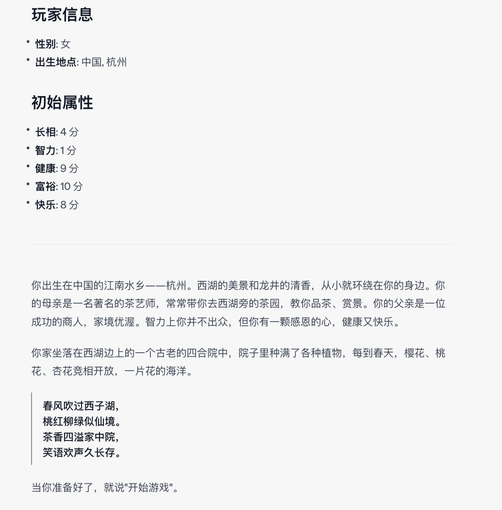
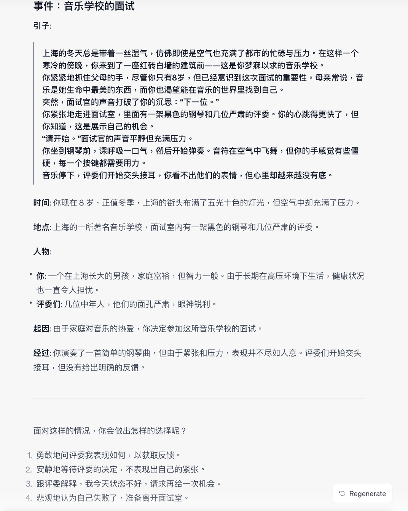
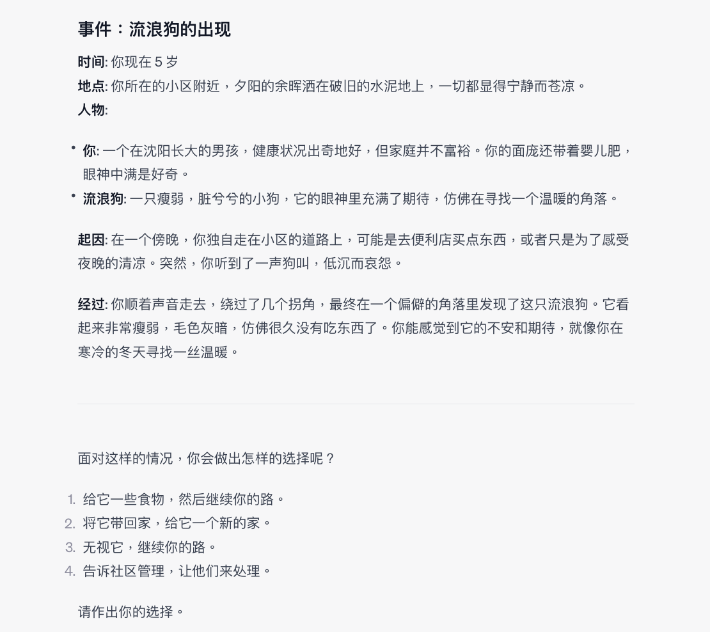
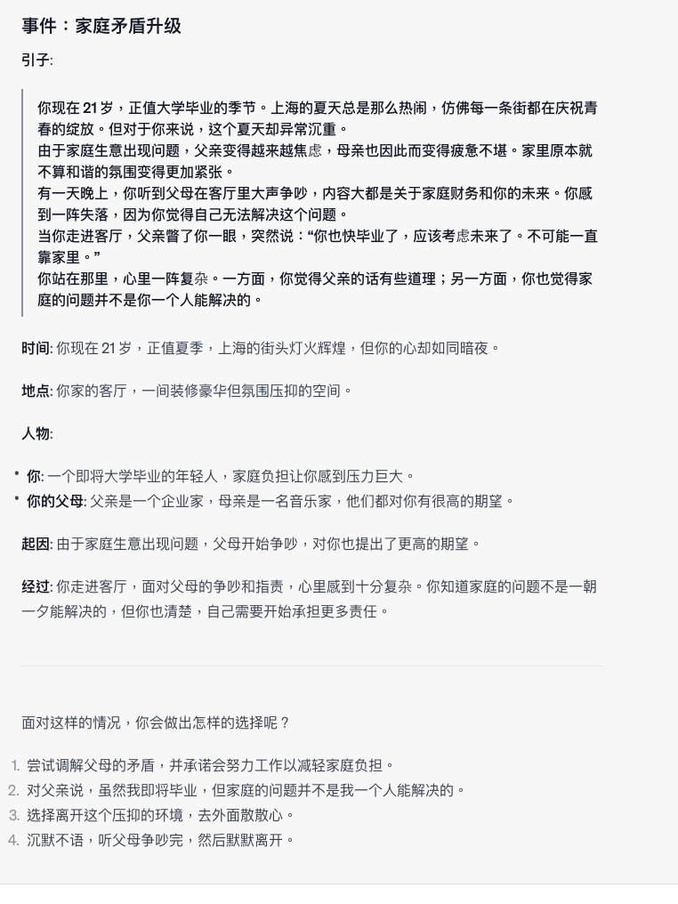
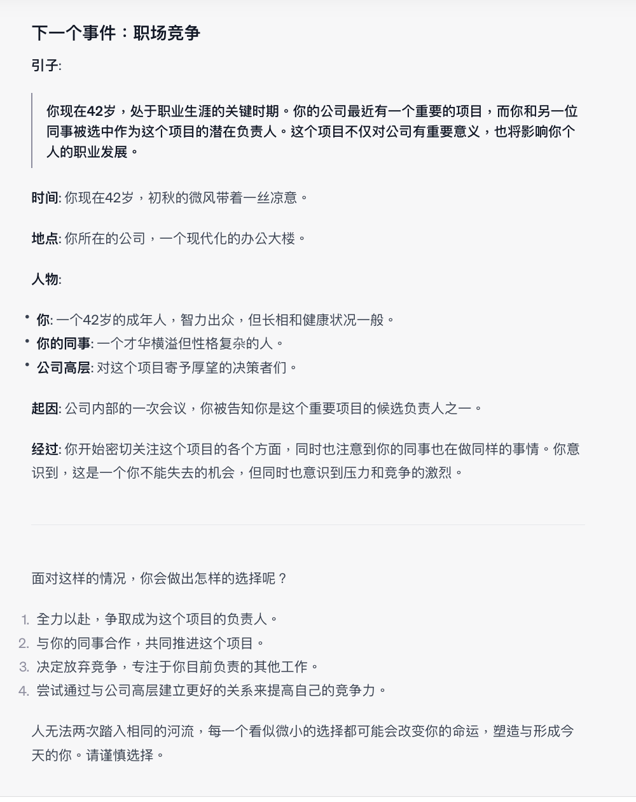

## 🐱🐹人生重来模拟器 LifeReloaded🐹🐱

### 🌟 引子

> “人生如梦，万事皆空；不过，'空'中便有万事万物。”  
> 如果你曾对人生有过无数的“如果”和“要是”，**人生重来模拟器 LifeReloaded** 给你一个重开的机会，焕发人生第二春！

---

### 🌈 项目概览

- **项目名称**: 人生重来模拟器 LifeReloaded
- **版本**: 0.1 beta
- **核心驱动**: GPT-4 Advanced Data Analysis
- **作者**: [陈财猫🐱](https://okjk.co/RBfY7P)

### 🚀 特性

1. **文学与人工智能的完美融合**: 精选的现代汉语文学风格，让你身临其境。
2. **利用发展心理学进行角色塑造**: 游戏内的人物不是单一的NPC，而是有背景，有立场，有情感的“人”。
3. **多元化的人生路径**: 从学业到职场，从爱情到家庭，每一个选择都会影响你的人生。
4. **随机性与可玩性**: 利用GPT-4的高级数据分析（原code interpreter）功能，由顶尖AI生成包罗万象的丰富人生，事件与属性真·随机。每一次游戏都是全新的体验。

### 📥 安装与运行
要运行游戏， 请打开GPT-4 的 [Advanced Data Analysis（原 Code Interpreter）功能](https://chat.openai.com/?model=gpt-4-code-interpreter)
，并将[LifeReloaded.txt](https://github.com/hamutama/LifeReloaded/blob/main/LifeReloaded.txt)中的所有内容复制粘贴进对话框中运行。

#### 前置条件

⚠️ **请务必开启 GPT-4 的 Advanced Data Analysis（原 Code Interpreter）功能，否则本游戏无法正常运行。目前该功能仅向ChatGPT Plus用户开放。**

#### 获取更新

🔗 本作品不定期更新，请访问 [本项目Github 仓库](https://github.com/hamutama/LifeReloaded) 或向公众号 [财猫AI](https://mp.weixin.qq.com/s/yMZ-Skk6mEa4tQPkHDtFTg) 发送“LifeReloaded”以取得最新版本。

### 🎮游戏预览

下面是一些游戏预览的截图。由于大语言模型的随机性，您的游戏体验可能会由于运气上下波动。

#### 初始化

每次进入游戏时，系统会真·随机为玩家生成与分配性别，出生地点，初始属性，家庭背景等。此外，每个人都会获得一首属于自己的独一无二的诗。

#### 事件

玩家会在不同的人生阶段遇到不同的事件，可以对事件做出反应。
每个事件与选项都是由GPT4 Code Interpreter 实时生成的，所以包罗万象。
您的每一个选择都会改变人物的人生走向或属性，请谨慎选择。

### 🤝 开源与合作

🔗 本游戏得到了[EmbraceAGI](https://github.com/EmbraceAGI) 开源社区的支持，与 [LangGPT](http://feishu.langgpt.ai) 为姊妹项目。

请点击[链接](https://github.com/yzfly/LangGPT)访问LangGPT项目GitHub仓库。

### 📜 协议

🔗 本项目使用 [CC BY-NC-SA 4.0（知识共享-署名-非商业性使用-相同方式共享 4.0 国际）](https://creativecommons.org/licenses/by-nc-sa/4.0/deed.zh) 协议开源。

### 💌 联系作者

如有任何疑问或建议，请通过以下方式联系我：

- 📧 Email: [陈财猫🐱](mailto:hamusuta@bupt.cn)
- 📞 微信公众号: [财猫AI](https://mp.weixin.qq.com/s/yMZ-Skk6mEa4tQPkHDtFTg)

---

### Special Thanks

- [Mr.renedeer项目](https://github.com/JushBJJ/Mr.-Ranedeer-AI-Tutor)，这个才华横溢的Prompt给了我很大启发。
- 《红楼梦》作者曹雪芹，是他启发我在文中可以插入诗歌。
- “南瓜博士”公众号，她的“可以使用Code Interpreter做一个[人生重来模拟器的Idea](https://mp.weixin.qq.com/s/gV6xvVVqG8djdmB6EAuZKw)”直接催生了本项目，[该公众号的高质量文章们](https://mp.weixin.qq.com/mp/appmsgalbum?action=getalbum&__biz=MzA4MjM5MDI0Ng==&scene=1&album_id=3104850832623386631&count=3#wechat_redirect)也给我一些启发。
- [刘海同学](https://nanfangshaonian.feishu.cn/wiki/WkKAwJ90uidtzVkM9IecSZB5nbg)分享的[伪代码提示词文章](https://nanfangshaonian.feishu.cn/wiki/YhNdws9LCi1JxGkpJ8dcXB3Gnih)
给了本Prompt一些启发。

---

🎮 **不要再等了，快来体验一把你的第二人生吧！**

---
