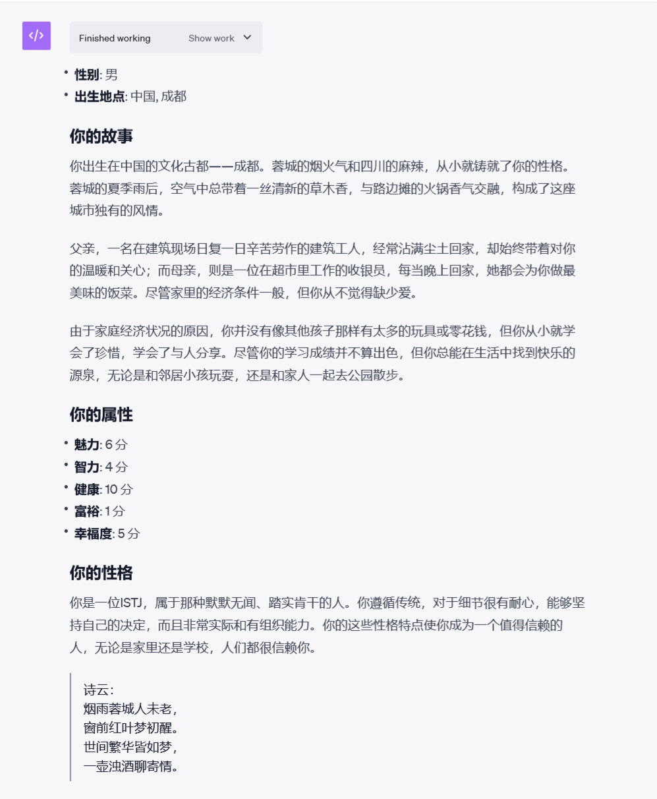

# 🐱🐹人生重来模拟器 LifeReloaded🐹🐱 (中文|[English](./README_EN.md))

## 🌟 引子

> “人生如梦，万事皆空；不过，'空'中便有万事万物。”  
> 如果你曾对人生有过无数的“如果”和“要是”，**人生重来模拟器 LifeReloaded** 给你一个重开的机会，焕发人生第二春！

## 🌈 项目概览

该项目是一个使用GPT-4 Advanced Data Analysis（原Code Interpreter）功能驱动的**交互式**模拟人生游戏。

游戏内容由顶尖人工智能 GPT4 实时生成，给您包罗万象，丰富多彩的真实人生体验。

- **项目名称**: 人生重来模拟器 LifeReloaded
- **版本**: 0.2 (updated at 20230922)
- **核心驱动**: GPT-4 Advanced Data Analysis
- **作者**: [陈财猫](https://okjk.co/RBfY7P), [Taited](https://Taited.github.io), [ydyjya](https://www.zhihu.com/people/warrior-18-53)

## 🚀 特性（ver 0.2 updated!）
- 🚀 **AI驱动,包罗万象**: 由 GPT-4 实时生成内容，事件与属性真·随机，为你带来无限的可能。
- 📖 **文学+人工智能的完美融合**: 精选现代汉语文学风格，为你带来沉浸式的游戏体验。
- 🎲 **利用心理学塑造角色**: 利用发展心理学设计人生事件，新增MBTI性格系统。游戏内的人物不是单一的NPC，而是有背景，有立场，有情感的“人”。
- 🌌 **多元宇宙**: 现在有小概率触发奇异事件，玩家将有机会体验到包括但不限于遇到外星人，穿越，童星之路等的精彩DLC内容。当然，您可自行选择是否穿越。
- 🛠️ **开源与社区**: 本项目属于[AIGoodGames](https://github.com/EmbraceAGI/AIGoodGames)项目,背靠[LangGPT](https://github.com/yzfly/LangGPT)结构化提示词社区。加入我们，授人以鱼更授人以渔，学习如何使用AI打造属于你自己的游戏！

## 📥 安装与运行
要运行游戏， 请打开GPT-4 的 [Advanced Data Analysis（原 Code Interpreter）功能](https://chat.openai.com/?model=gpt-4-code-interpreter)
，并将[LifeReloaded.txt](https://github.com/hamutama/LifeReloaded/blob/main/LifeReloaded.txt)中的所有内容复制粘贴进对话框中运行。
你可以可以点击[链接](https://chat.openai.com/share/25c02186-e518-4ac0-9072-1281b2f47d84)查看prompt

### 前置条件

⚠️ **请务必开启 GPT-4 的 Advanced Data Analysis（原 Code Interpreter）功能，否则本游戏无法正常运行。目前该功能仅向ChatGPT Plus用户开放。**

## 💡 加入社区
我们的交流社区AIGG（AI Good Games）由[EmbraceAGI](https://github.com/EmbraceAGI)组织管理，背靠[LangGPT](https://github.com/yzfly/LangGPT)结构化提示词项目，目前正在招募新成员。
欢迎每一位玩家和开发者的参与，点击[链接](https://ubdnzdt3m9.feishu.cn/wiki/PqXxw0Sa7iRCUUksuaDcEWDin5g?from=from_copylink)
加入AIGG社区！

💡 **作为想写出自己的AI游戏的开发者，您可以：**
- 探索AI在游戏开发中的无限可能性，获得提示词工程，LLM程序开发等方向的指导。
- 与行业内大牛交流，分享和学习最新的AI游戏开发技巧。
- 获得早期访问权，体验和测试我们的最新功能和工具。
- 作品入驻社区可获得流量曝光与社区助推。

🎮 **作为玩家，您将可以：**
- 获取本社区新上游戏的一手信息，有机会内测试玩。
- 与其他玩家分享游戏经验和人生故事。
- 提出建议，影响游戏的未来方向。

## 🎮 游戏预览

下面是一些游戏预览的截图。由于大语言模型的随机性，您的游戏体验可能会由于运气上下波动。

### 初始化

每次进入游戏时，系统会真·随机为玩家生成与分配性别，出生地点，初始属性，家庭背景与mbti性格。

此外，每个人都会获得一首属于自己的独一无二的诗。

### 普通事件

玩家会在不同的人生阶段遇到不同的事件，可以对事件做出反应。

每个事件与选项都是由GPT4 Code Interpreter 实时生成的。

您的每一个选择都会改变人物的人生走向或属性，而属性与性别则有可能会带来特殊选项，请谨慎选择。

### 特殊事件
在每轮游戏中，您有小概率（每轮约1/16）可能遇到特殊事件。

特殊事件将完全改变您的人生轨迹，包括但不限于穿越去古代，遇见外星人，参加童星选秀等等。

特殊事件完全由GPT4自动生成，没有人可以预料你会遇到什么。

如果您去往了新的世界，您有可能会一直在那里生活下去。
当然，决策权在你手上，您也可以拒绝奇遇，继续过普通的人生。

在奇遇中，玩家要是不满意，也可以随时要求GPT重新创作，给您带来更好的体验。

## 🤝 开源与合作

🔗 本游戏得到了 开源社区的支持，与 [LangGPT](http://feishu.langgpt.ai) 为姊妹项目。

请点击访问LangGPT项目GitHub仓库。

## 📜 协议

🔗 本项目使用 [CC BY-NC-SA 4.0（知识共享-署名-非商业性使用-相同方式共享 4.0 国际）](https://creativecommons.org/licenses/by-nc-sa/4.0/deed.zh) 协议开源。

## 💌 联系作者

如有任何疑问或建议，请通过以下方式联系我：

- 📧 Email: [陈财猫🐱](mailto:hamusuta@bupt.cn)
- 📞 微信公众号: [财猫AI](https://mp.weixin.qq.com/s/yMZ-Skk6mEa4tQPkHDtFTg)

## 广告时间

我会在我的微信公众号[财猫AI](https://mp.weixin.qq.com/mp/appmsgalbum?__biz=MzkxNTU1MTY3OA==&action=getalbum&album_id=3086731117975814150&scene=173&from_msgid=2247484520&from_itemidx=1&count=3&nolastread=1#wechat_redirect)
上更新一系列提示工程文章，敬请关注。

此外，你可以在微信读书上读到我的出版书籍《ChatGPT进阶 提示工程入门》，也可以通过电商渠道购买。

## Special Thanks

- [Mr.renedeer项目](https://github.com/JushBJJ/Mr.-Ranedeer-AI-Tutor)，这个才华横溢的Prompt给了我很大启发。
- 《红楼梦》作者曹雪芹，是他启发我在文中可以插入诗歌。
- “南瓜博士”公众号，她的“可以使用Code Interpreter做一个[人生重来模拟器的Idea](https://mp.weixin.qq.com/s/gV6xvVVqG8djdmB6EAuZKw)”直接催生了本项目，[该公众号的高质量文章们](https://mp.weixin.qq.com/mp/appmsgalbum?action=getalbum&__biz=MzA4MjM5MDI0Ng==&scene=1&album_id=3104850832623386631&count=3#wechat_redirect)也给我一些启发。
- [刘海同学](https://nanfangshaonian.feishu.cn/wiki/WkKAwJ90uidtzVkM9IecSZB5nbg)分享的[伪代码提示词文章](https://nanfangshaonian.feishu.cn/wiki/YhNdws9LCi1JxGkpJ8dcXB3Gnih)
给了本Prompt一些启发。

---

> 🎮 **不要再等了，快来体验一把你的第二人生吧！**
