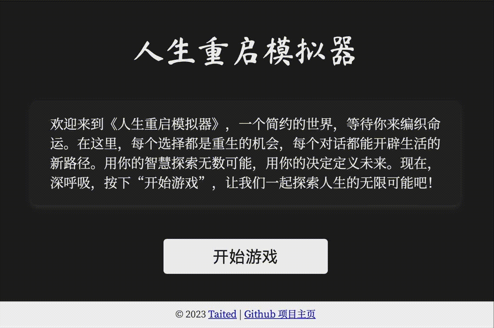

# 🐱🐹人生重来模拟器 LifeReloaded🐹🐱 (中文|[English](./README_EN.md))
[](https://github.com/hamutama/LifeReloaded/stargazers)


## 🌟 引子

> “人生如梦，万事皆空；不过，'空'中便有万事万物。”  
> 如果你曾对人生有过无数的“如果”和“要是”，**人生重来模拟器 LifeReloaded** 给你一个重开的机会，焕发人生第二春！

## 🔥🔥🔥 Web版更新 (ver 0.3)
Web版现已更新至0.3版本！此版本不仅继承了原项目的精髓，还针对 GPT-3.5 特性进行了优化，简化了玩家的操作体验。得益于[EmbraceAGI社区](https://github.com/EmbraceAGI/)的支持，我们不断与玩家和开发者互动，推动 AI 在游戏行业的创新发展。

欢迎通过此[链接](https://sun-zhengwt.com/life-reload/)试玩，享受由 AI 技术打造的全新人生重启体验。



## 🌈 项目概览

该项目是一个使用GPT-4 Advanced Data Analysis功能驱动的**交互式**模拟人生游戏。

- **项目名称**: 人生重来模拟器 LifeReloaded
- **版本**: 0.3 (2023年11月13日更新)
- **核心驱动**:
  - **ChatGPT版本**: GPT-4 Advanced Data Analysis
  - **Web版**: GPT-3.5-Turbo
- **作者**: [Taited](https://Taited.github.io), [陈财猫](https://okjk.co/RBfY7P), [ydyjya](https://www.zhihu.com/people/warrior-18-53)

## 🚀 特性（ver 0.3 updated!）
- 🌐 **Web版特性**:
  - ⏰ **游戏时长**: 整个游戏流程的内容生成时间已从原先的30分钟缩短至10分钟，大幅提升了效率。
  - 🛠️ **交互界面**: 由GPT-3.5-turbo驱动的Web版提供了一个更加便捷且直观的用户交互平台。
- 🤖 **ChatGPT版特性**
  - 🚀 **AI驱动,包罗万象**: 由 GPT-4 实时生成内容。
  - 📖 **文学+人工智能的完美融合**。
  - 🎲 **利用心理学塑造角色**: 新增MBTI性格系统。
  - 🌌 **多元宇宙**: 小概率触发奇异事件，如遇到外星人、穿越等。

## 📥 安装与运行
### Web版安装
#### 1. 安装依赖
```bash
pip install -r requirements.txt
```

#### 2. 设置环境变量
- 创建 `.env` 文件，内容结构参照 `.env.example`。
- 更新 `OPENAI_API_KEY` 和 `REDIS` 等特定值。

#### 3. 运行代码
```bash
python app.py
```

#### 贡献指南
- 使用 `pre-commit` 工具自动格式化代码。
- 详细指南见仓库文档。

### ChatGPT版运行
打开GPT-4 的 [Advanced Data Analysis功能](https://chat.openai.com/?model=gpt-4-code-interpreter) 并运行 [LifeReloaded.txt](https://github.com/hamutama/LifeReloaded/blob/main/LifeReloaded.txt)。

#### 前置条件
⚠️ **需开启 GPT-4 的 Advanced Data Analysis功能，目前仅限ChatGPT Plus用户。**

## 💡 加入社区
我们的交流社区AIGG（AI Good Games）由[EmbraceAGI](https://github.com/EmbraceAGI)组织支持，背靠[LangGPT](https://github.com/yzfly/LangGPT)结构化提示词项目，目前正在招募新成员。
欢迎每一位玩家和开发者的参与，点击[链接](https://ubdnzdt3m9.feishu.cn/wiki/PqXxw0Sa7iRCUUksuaDcEWDin5g?from=from_copylink)
加入AIGG社区！

💡 **作为想写出自己的AI游戏的开发者，您可以：**
- 探索AI在游戏开发中的无限可能性，获得提示词工程，LLM程序开发等方向的指导。
- 与行业内大牛交流，分享和学习最新的AI游戏开发技巧。
- 获得早期访问权，体验和测试我们的最新功能和工具。
- 作品入驻社区可获得流量曝光与社区助推。

🎮 **作为玩家，您将可以：**
- 获取本社区新上游戏的一手信息，有机会内测试玩。
- 与其他玩家分享游戏经验和人生故事。
- 提出建议，影响游戏的未来方向。

## 🎮 游戏预览

下面是一些游戏预览的截图。由于大语言模型的随机性，您的游戏体验可能会由于运气上下波动。

### 初始化

每次进入游戏时，系统会真·随机为玩家生成与分配性别，出生地点，初始属性，家庭背景与mbti性格。

此外，每个人都会获得一首属于自己的独一无二的诗。


### 普通事件

玩家会在不同的人生阶段遇到不同的事件，可以对事件做出反应。

每个事件与选项都是由GPT4 Code Interpreter 实时生成的。

您的每一个选择都会改变人物的人生走向或属性，而属性与性格则有可能会带来特殊选项，请谨慎选择。


### 特殊事件
在每轮游戏中，您有小概率（每轮约1/10）可能遇到特殊事件。

特殊事件将完全改变您的人生轨迹，包括但不限于穿越去古代，遇见外星人，参加童星选秀等等。

特殊事件完全由GPT4自动生成，没有人可以预料你会遇到什么。

如果您去往了新的世界，您有可能会一直在那里生活下去。
当然，决策权在你手上，您也可以拒绝奇遇，继续过普通的人生。


在奇遇中，玩家要是不满意，也可以随时要求GPT重新创作，给您带来更好的体验。


### 人生的终结
每一个人生都有终结的时候，死亡是所有人的宿命。无论是英年早逝还是神龟虽寿，您都将在本次人生结束后获得一个墓志铭。


## 📜 协议

🔗 本项目使用 [CC BY-NC-SA 4.0（知识共享-署名-非商业性使用-相同方式共享 4.0 国际）](https://creativecommons.org/licenses/by-nc-sa/4.0/deed.zh) 协议开源。

## 💌 联系团队

如有任何疑问或建议，请通过以下方式与我们团队联系：

- 📧 Email: [Taited](mailto:zhengwt.sun@connect.polyu.hk)
- 📧 Email: [陈财猫🐱](mailto:hamusuta@bupt.cn)
- 📞 微信公众号: [财猫AI](https://mp.weixin.qq.com/s/yMZ-Skk6mEa4tQPkHDtFTg)

<!-- ## 广告时间

我们将在微信公众号[财猫AI](https://mp.weixin.qq.com/mp/appmsgalbum?__biz=MzkxNTU1MTY3OA==&action=getalbum&album_id=3086731117975814150&scene=173&from_msgid=2247484520&from_itemidx=1&count=3&nolastread=1#wechat_redirect)上更新一系列有关提示工程的文章，敬请关注。

此外，您可以在微信读书上找到我们出版的书籍《ChatGPT进阶 提示工程入门》，也可以通过电商渠道进行购买。
 -->

## 特别感谢

- [Mr.renedeer项目](https://github.com/JushBJJ/Mr.-Ranedeer-AI-Tutor)，这个才华横溢的项目给予了我们极大的启发。
- 《红楼梦》作者曹雪芹，他的作品启发我们在文中融入诗歌元素。
- “南瓜博士”公众号，其提出的“使用Code Interpreter制作人生重来模拟器”的想法直接催生了本项目，[该公众号的高质量文章](https://mp.weixin.qq.com/mp/appmsgalbum?action=getalbum&__biz=MzA4MjM5MDI0Ng==&scene=1&album_id=3104850832623386631&count=3#wechat_redirect)也给予了我们灵感。
- [刘海同学](https://nanfangshaonian.feishu.cn/wiki/WkKAwJ90uidtzVkM9IecSZB5nbg)分享的[伪代码提示词文章](https://nanfangshaonian.feishu.cn/wiki/YhNdws9LCi1JxGkpJ8dcXB3Gnih)也为本项目提供了启示。

---

> 🎮 **不要再等了，快来体验一把你的第二人生吧！**
