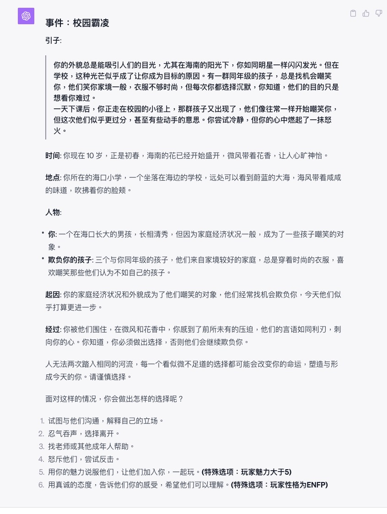
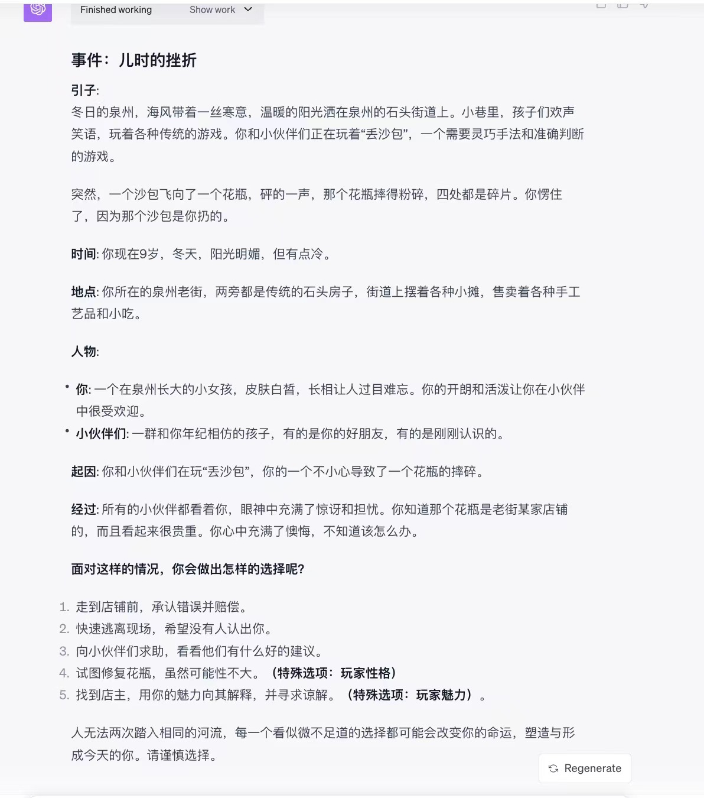
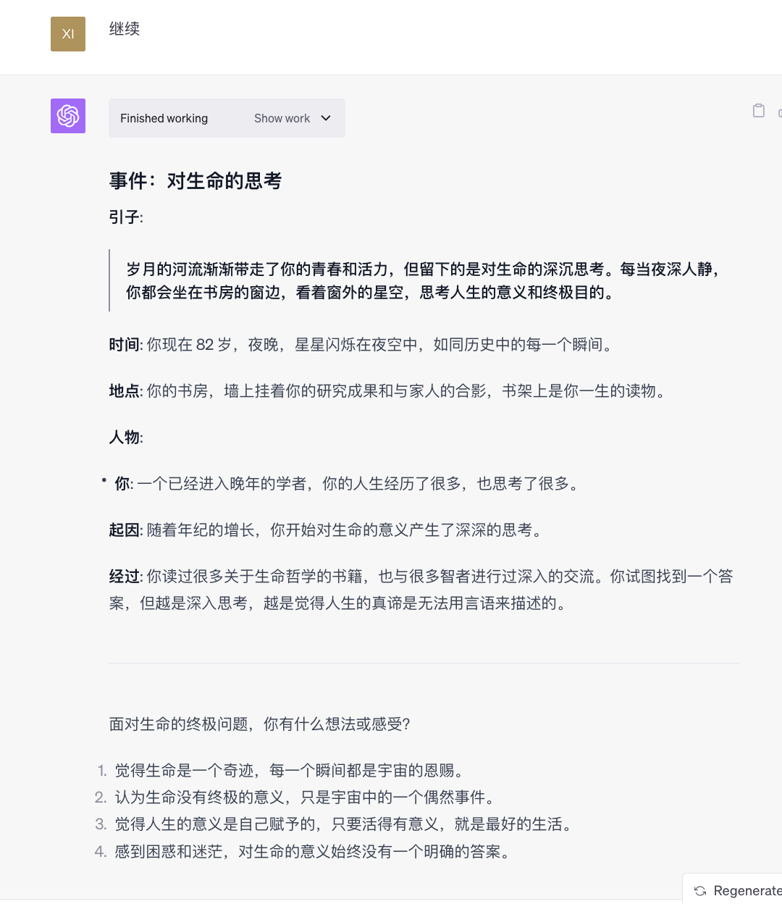
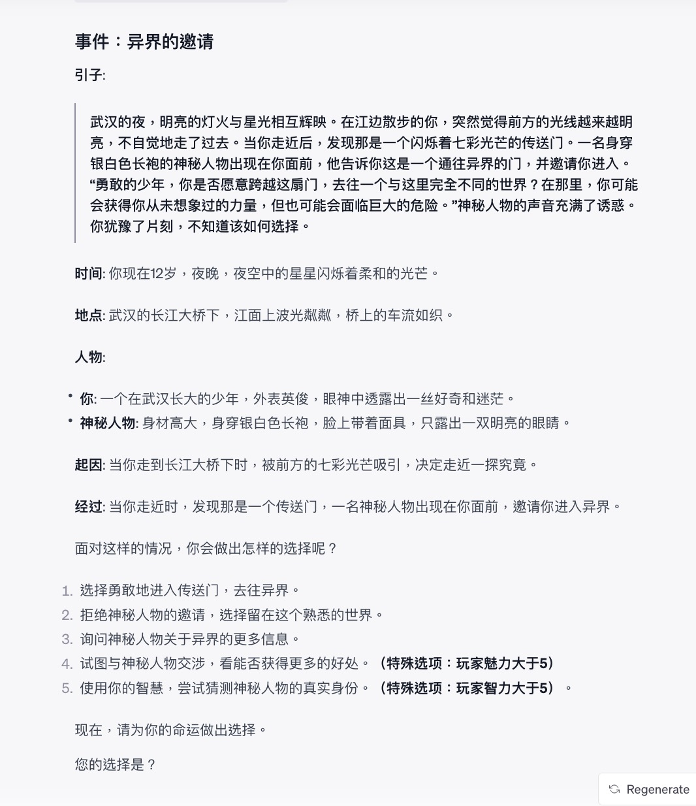

# 🐱🐹 LifeReloaded Simulator 🐹🐱 ([Chinese](./README.md)|English)

[](https://github.com/hamutama/LifeReloaded/stargazers)


## 🌟 Introduction

> "Life is but a dream, where everything seems fleeting; yet, within this fleetingness, lies the essence of all existence."
> Have you ever wondered about the countless "what ifs" in life? **LifeReloaded Simulator** offers you a second chance to rejuvenate and relive life!

## 🔥🔥🔥 Web Version Updated on Nov. 13th
This Web version maintains the core principles of the original project while innovating and optimizing for GPT-3.5 features, streamlining the user experience without the need to configure GPT-4. Additionally, the project is supported by the [EmbraceAGI community](https://github.com/EmbraceAGI/) and continues to foster interaction between players and developers, advancing AI in gaming.

You are invited to try the game via this [link](https://sun-zhengwt.com/life-reload/). Our goal with this Web version is to provide a more accessible and intuitive platform, allowing a wider audience to enjoy the unique experience of restarting life through AI technology.


## 🌈 Overview 

This project is a life simulation game powered by GPT-4's Advanced Data Analysis (formerly Code Interpreter) feature.

The game content is dynamically generated by the top-tier AI, GPT-4, providing a comprehensive and vibrant real-life experience.

- **Project Name**: LifeReloaded Simulator
- **Version**: 0.3 (updated at 20231113)
- **Core Engine**: GPT-4 Advanced Data Analysis
- **Author**: [Chen CaiMao🐱](https://okjk.co/RBfY7P), [Taited](https://Taited.github.io), [ydyjya](https://www.zhihu.com/people/warrior-18-53)

## 🚀 Features（ver 0.3 updated!）
- 🚀**AI-Powered, All-Encompassing**: Real-time content generation by GPT-4. Experience true randomness that opens up infinite possibilities.
- 📖**A Union of Literature & AI**: Carefully curated styles from modern European literature to offer an immersive gaming experience.
- 🎲**Psychologically Crafted Characters**: Leveraging developmental psychology to design life events and introducing the MBTI personality system. The characters in the game aren't mere NPCs; they're individuals with histories, stances, and emotions.
- 🌌**A Diverse Universe**: Now with a rare chance to trigger peculiar events. Players may experience exciting DLC contents such as encounters with extraterrestrials, time travel, or a journey to stardom. And yes, the choice to time travel is entirely yours.
- 🛠️**Open Source & Community Driven**: This project is part of [AIGoodGames](https://github.com/EmbraceAGI/AIGoodGames), supported by the [LangGPT](https://github.com/yzfly/LangGPT) structured prompt community. Join us, not only to get a fish but to learn to fish – learn how to use AI to craft your very own game!

## 📥 Installation & Execution

### Installation of Web Version
#### 1. Installing Dependencies

To install the necessary dependencies for this project, use the following command:

```bash
pip install -r requirements.txt
```

##### Optional: Redis Configuration for Improved Performance

If you wish to improve the performance, please configure a Redis service on your local machine and install the Python redis dependency:

```bash
pip install redis
```

#### 2. Setting Up Environment Variables

For the proper functioning of this project, you need to set some environment variables.

- Create a new file in the project root directory with the name `.env`.

- The content structure of `.env` should mirror that of `.env.example`. However, make sure to update specific values. Particularly:

  - Replace the placeholder for the `OPENAI_API_KEY` with your actual API key.
  - Replace the placeholder for the `REDIS` with your actual Redis password.

**Note**: If you're planning to run the project locally without Redis, maintain the `REDIS` attribute as given in `.env.example` without any changes.

#### 3. Running the Code

Once you've set up the environment variables, you can execute the project within terminal by:

```
python moderator.py
```

If you would like to launch this project locally, you can run the script:

```
python app.py
```

#### Contributing to this Repository

To ensure code consistency and quality, this repository utilizes the `pre-commit` tool to automatically format code. Before making any contributions or commits, it's recommended that you set up `pre-commit`.

##### Setting Up `pre-commit`

1. **Install `pre-commit`**: Use the following command to install or upgrade `pre-commit`:

   ```bash
   pip install -U pre-commit
   ```

2. **Install Git Hooks**: Once `pre-commit` is installed, you'll need to set it up for this repository. Run the following command:

   ```bash
   pre-commit install
   ```

After setting up, the pre-commit hooks will automatically check and format your changes before each commit. This helps to maintain code consistency throughout the project.


### Execution of ChatGPT
To run the game, open GPT-4's [Advanced Data Analysis (formerly Code Interpreter) feature](https://chat.openai.com/?model=gpt-4-code-interpreter)
and paste the content from [LifeReloaded.txt](https://github.com/hamutama/LifeReloaded/blob/main/LifeReloaded.txt) into the dialogue box.
You can also check out the [prompt here](https://chat.openai.com/share/25c02186-e518-4ac0-9072-1281b2f47d84).

### Prerequisites

⚠️ **Please ensure you have activated the GPT-4's Advanced Data Analysis feature. Currently, this feature is available only to ChatGPT Plus users.**

## 💡 Community

Our community, AIGG (AI Good Games), is managed by the [EmbraceAGI](https://github.com/EmbraceAGI) organization and is backed by the [LangGPT](https://github.com/yzfly/LangGPT) structured prompt project. We're currently recruiting new members.
We welcome participation from every gamer and developer. Click on this link to join the AIGG community!

💡 **For developers aspiring to craft their own AI games**:
- Explore the endless possibilities of AI in game development, with guidance in areas like prompt engineering and LLM program development.
- Network with industry experts, sharing and learning the latest AI game development techniques.
- Gain early access rights to experience and test our most recent features and tools.
- Showcase your creations in the community and benefit from increased exposure and community support.

🎮 **For gamers**:
- Stay updated with firsthand information on new games released in our community and get the chance to be a beta tester.
- Share gaming experiences and life stories with fellow gamers.
- Provide feedback and influence the future direction of the games.

## 🎮 Game Previews

Here are some previews of the game. Due to the randomness of the large language model, your gameplay experience might vary.

### Initialization

Every time you enter the game, the system truly randomizes and assigns a gender, birthplace, initial attributes, family background, and MBTI personality for the player.

Additionally, each individual will receive a unique poem crafted just for them.


### Normal Events

Players will encounter various events at different stages of life and can react to these events.

Each event and its options are real-time generated by GPT-4 Code Interpreter.

Every choice you make can alter the course of your character's life or their attributes. Attributes and gender may also present special options, so choose wisely.







###　Special Events
In each game round, there's a small chance (about 1 in 16) that you might encounter a special event.

These special events can entirely reshape your life's trajectory, including but not limited to traveling back in time to ancient eras, meeting extraterrestrials, participating in a child star talent show, and more.

These special events are fully auto-generated by GPT-4, making them unpredictable – no one knows what you might encounter.

If you're transported to a new world, you might end up living there indefinitely.
Of course, the choice remains yours. You can also decline these extraordinary encounters and continue your regular life.





During these adventures, if players are dissatisfied, they can always request GPT-4 to recreate the scenario, ensuring a better experience.


## 🤝 Open Source & Collaboration

🔗 This game has received support from the [EmbraceAGI](https://github.com/EmbraceAGI) open-source community and is a sister project to [LangGPT](http://feishu.langgpt.ai).

Visit the [LangGPT project on GitHub](https://github.com/yzfly/LangGPT).

## 📜 License

🔗 This project is open-sourced under the [CC BY-NC-SA 4.0 (Creative Commons Attribution-NonCommercial-ShareAlike 4.0 International)](https://creativecommons.org/licenses/by-nc-sa/4.0/).

## 💌 Contact the Author

For inquiries or suggestions, please reach out via:

- 📧 Email: [Chen CaiMao🐱](mailto:hamusuta@bupt.cn)
- 📞 Public Account: [CaiMaoAI](https://mp.weixin.qq.com/s/yMZ-Skk6mEa4tQPkHDtFTg)

## Advertisement

Follow my public account [CaiMaoAI](https://mp.weixin.qq.com/mp/appmsgalbum?__biz=MzkxNTU1MTY3OA==&action=getalbum&album_id=3086731117975814150&scene=173&from_msgid=2247484520&from_itemidx=1&count=3&nolastread=1#wechat_redirect) for a series of informative articles.

Additionally, you can read my published book "ChatGPT Advanced: An Introduction to Prompt Engineering" on WeChat Reading or purchase it through online retailers.


## Special Thanks

- [Mr.renedeer project](https://github.com/JushBJJ/Mr.-Ranedeer-AI-Tutor) －　This brilliant prompt provided significant inspiration for my work.
- Cao Xueqin, the author of "Dream of the Red Chamber" - He inspired the inclusion of poetry within the narrative.
- "Dr. Pumpkin" WeChat public account - Her idea of creating a [Life-Reloading Simulator using the Code Interpreter](https://mp.weixin.qq.com/s/gV6xvVVqG8djdmB6EAuZKw) directly led to the birth of this project. [The high-quality articles on her public account](https://mp.weixin.qq.com/mp/appmsgalbum?action=getalbum&__biz=MzA4MjM5MDI0Ng==&scene=1&album_id=3104850832623386631&count=3#wechat_redirect) also sparked some ideas.
- Thanks to [Liu Hai]((https://nanfangshaonian.feishu.cn/wiki/WkKAwJ90uidtzVkM9IecSZB5nbg)) for sharing the [pseudo-code prompt article](https://nanfangshaonian.feishu.cn/wiki/YhNdws9LCi1JxGkpJ8dcXB3Gnih), which provided some insights for this prompt.


---

> 🎮 **Don't wait any longer, come and experience your second life now!**
